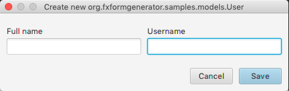
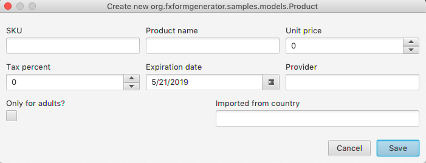

# FXFormGenerator
Automatic Form (UI) generator for JavaFX

## Usage
Define your Java entities as usual in Java FX:
```java
public class User {
    private StringProperty username = new SimpleStringProperty();
    private StringProperty fullName = new SimpleStringProperty();
    
    // ... Getters and setters omitted
}
```

Now use the `FXFormGenerator` to "automagically" generate a form UI:
```java

    User user = new User();
    FXFormGenerator
        .forModel(user)
        .showAsDialog(o -> {

            // Callback is executed after the form has been filled
            System.out.println("Now user object is updated with form data");
        });
```



## A complex usage case
Usually you gonna need to customize the labels of fields, the order and the layout. You can
customize all this properties and even more.

```java
public class Product {

    private StringProperty uniqueCode = new SimpleStringProperty();
    private StringProperty productName = new SimpleStringProperty();
    private DoubleProperty unitPrice = new SimpleDoubleProperty();
    private FloatProperty taxPercent = new SimpleFloatProperty();

    private Date expirationDate = new Date();
    private StringProperty provider = new SimpleStringProperty();
    private BooleanProperty adultsOnly = new SimpleBooleanProperty();
    private StringProperty originCountry = new SimpleStringProperty();
    
    // Getters and setters ommited
}

// Now create the form UI
Product product = new Product();
FXFormGenerator
    .forModel(product)
    
    // Set custom labels for specific fields
    .assignFieldLabel("uniqueCode", "SKU")
    .assignFieldLabel("adultsOnly", "Only for adults?")
    .assignFieldLabel("originCountry", "Imported from country")
    
    // Setup the order of fields
    .assignFieldsOrder(
            "uniqueCode",
            "productName",
            "unitPrice",
            "taxPercent",
            "expirationDate",
            "provider",
            "adultsOnly",
            "originCountry")
            
    // Force the row to fullfil width of parent node
    .assignFormLayout(FFGLayout.MULTIPLE_FULLWIDTHROWS_COLUMNS)
    
    // Make the form visible
    .showAsDialog(o -> {
        System.out.println("Saving product");
    });
```



## More examples
I'm working in document all the library, in the meantime, you can checkout
the package `org.fxformgenerator.samples` for usage of other properties
and features

## Features

### Core features
 * Appropriate inputs for Java types:
    - `String` => `TextInput` (You can force to `TextArea`)
    - `int` => `Spinner`
    - `double` => `Spinner`
    - `float` => `Spinner`
    - `boolean` => `CheckBox`
    - `Date` => `DatePicker`
    - `LocalDate` => `DatePicker`
    - `Object` => (You can pass an observable list with possible options)
    - `Other` => (You can always pass a custom `Node` to use as editor for a given POJO property)
 * Exclude fields from be included into form.
 * Form validation through java validation API (Error labels displayed into form).
 * Display the form as a Dialog
 * Construct the form and return it as a Node to be included into your UI components.
 * Display the form in *read only* mode using labels to display POJO properties values.

### Aesthetic features
 * Assign custom text for each field label
 * Assign custom order for the form fields
 * Configure the inputs distribution layout (Single column | Multiple columns | Multiple (Fill width rows) columns)
 * Assign custom text for title, header and buttons text when form is showed as a Dialog
 
## TODOs
 * [ ] Support to customize/configure form through annotations in POJO
 * [ ] Support for custom layout definition
 * [ ] Support for custom field min/max width definition
 * [ ] Support to custom fields rows spacing and input groups spacing
 * [ ] Support to custom form main container padding/margin
 * [ ] Support for custom CSS over form elements
 
## Contributors
  * Giovanni Aguirre | [@DiganmeGiovanni](https://github.com/DiganmeGiovanni)
